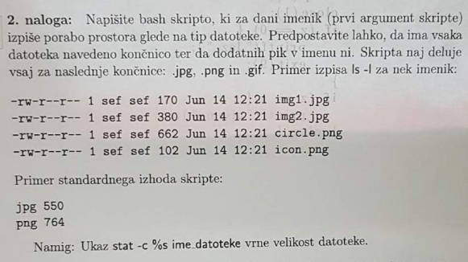

# Skripte
### Velikost slikovnih datotek
#



Skripta izpiše skupek prostora, ki ga porabijo slikovne datoteke.

```bash
#!/bin/bash

dir=$1 # V navodilu piše, da je prvi argument imenik v katerem bomo preštevali velikosti

jpg=0;png=0;gif=0; # Inicializiram spremenljivke, kjer bom shranjeval koliko prostora zapravljajo datoteke

for i in $(ls $dir); do # Loopam po seznamu datotek, ki sem jih dobil prek ukaza "ls" z argumentom "$dir" v podlupini

    size=$(stat -c %s "$dir/$i") # Z ukazom podanim v navodilu dobim velikost trenutne datoteke, ki jo gledam

    type=${i##*.} # Uporabim nekaj s ppt-ja "Skriptiranje", da odstranim vse znake do prve pojavitve "."

    case $type in # Switch, kjer mi odvisno od končnice ali prišteje k velikostim, ali pa ne naredi ničesar če ni nič od naštetega

        "jpg") jpg=$(( jpg + size )) ;; 
        "png") png=$(( png + size )) ;;
        "gif") gif=$(( gif + size )) ;;
        *) ;;
    esac;
done
 # Če ne zapravi nič prostora, reči ne bom izpisal, ker je tako prikazano tudi na papirju

    [ $jpg -ne 0 ] && echo "jpg" $jpg 
    [ $png -ne 0 ] && echo "png" $png
    [ $gif -ne 0 ] && echo "gif" $gif

exit 0;

# /home/lukawernig/Pictures/Wallpapers, path na katerem sem stestiral in je delovalo pravilno

```
  
  
### Predniki
#
  
![predniki][predniki.png]

Skripta, ki izpiše vse prednike nekih procesov, katerih PID so podani v datoteki, ki je podana v prvem argumentu.
Tu je dodano še preverjanje, če datoteka sploh obstaja, da je bilo testiranje delovanja možno.
Sklepam, da na dejanskem kolokviju to NE bi bilo potrebno

```bash
#!/bin/bash

file=$(cat $1) # V file shranim vsebino podane datoteke
for i in $file; do # Loopam po vseh PID-jih v datoteki
    pid_starsa= # Inicializiram starsa
    column=4 # Cel ta postopek bi lahko bil tudi le pid_starsa=$(cat /proc/$i/stat | cut -d" " -f 4), ampak obstajajo izjeme, ki uporabljajo " " znotraj drugega stolpca
    while [[ $pid_starsa != [0-9]* ]]; do # Preveri če je PID že številka (ali je kakšen stolpec prej uporabil " " znotraj sebe)
        if [[ ! -e "/proc/$i/stat" ]]; then # Če datoteka ne obstaja -> break
            break;
        fi
        pid_starsa=$(cat /proc/$i/stat | cut -d" " -f $column); # pid_starsa dobi vrednost v column-tem stolpcu, po delimiterju " "
        column+=1; # Se premaknem na naslednji stolpec
    done;

    while [[ $pid_starsa != "1" && $pid_starsa != "0" ]]; do # 1 nima starša, 0 ni PID, če ima to proces kot starša, pomeni, da je brez staršev
        if [[ -z $pid_starsa ]]; then # Če prej nismo dobili nobenega pid_starsa, pomeni da PID, ki smo ga prebrali ne obstaja
            break;
        fi
        echo -n "$pid_starsa " # Izpiše PID starsa
        i=$pid_starsa # i postane PID starsa
        pid_starsa= # Ponovi se zgornji postopek za iskanje pid_starsa
        column=4 
        while [[ $pid_starsa != [0-9]* ]]; do
            if [[ ! -e "/proc/$i/stat" ]]; then
                break;
            fi
            pid_starsa=$(cat /proc/$i/stat | cut -d" " -f $column);
            column+=1;
        done;
    done
    [[ -n $pid_starsa && $pid_starsa != "0" ]] && echo $pid_starsa || echo # Preveri, če je pid_starsa prazen, 0 ali 1. karkoli izpiše samo v primeru, da je 1.
done
exit 42;
```
